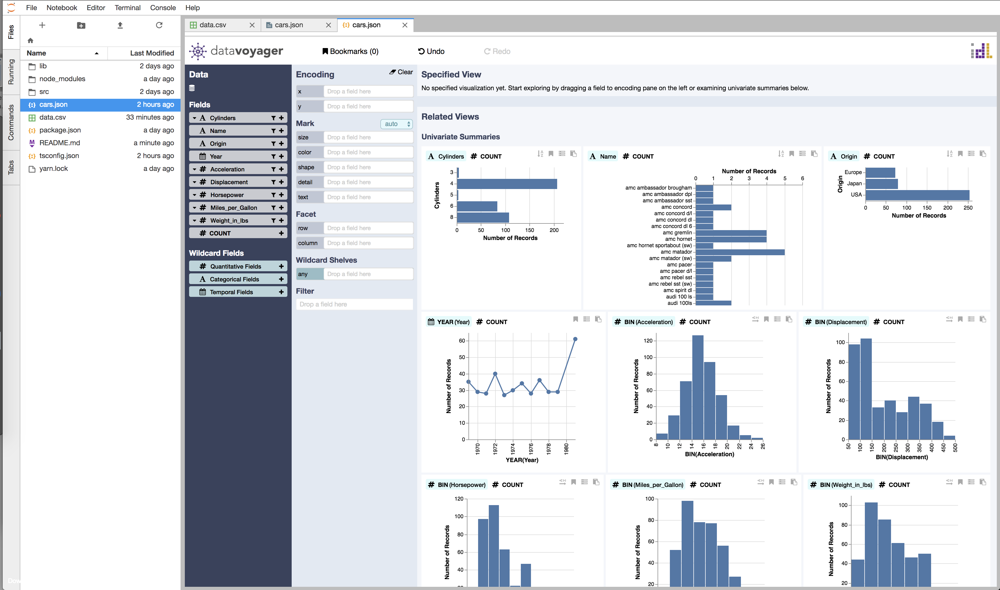

# jupyterlab_voyager

[](https://www.npmjs.com/package/jupyterlab_voyager)
[](https://travis-ci.org/saulshanabrook/jupyterlab_voyager)

A JupyterLab MIME renderer extension to view CSV and JSON data in [Voyager 2](https://github.com/vega/voyager#voyager-2).



## Prerequisites

* JupyterLab

## Installation

```bash
jupyter labextension install jupyterlab_voyager
```

You can also use this with the Docker base images:

```Dockerfile
FROM jupyter/minimal-notebook
RUN jupyter labextension install jupyterlab_voyager
CMD start.sh jupyter lab
```


Then right click on any `csv` or `json` file click "Open with...", then "Voyager".

## Development

For a development install (requires npm version 4 or later and yarn), do the following in the repository directory:

```bash
yarn install
jupyter labextension link .
```

Then build the files and start Jupyter Lab:

```bash
yarn watch
# in new window
jupyter lab --port=8889 --watch
```

Reload the page to see new code changes.

## Docker

If you have Docker version >= 17.09.0-ce installed, you can also do all of the above with:

```bash
docker-compose up
```

If you change the installed packages, you have to remove the existing volume and rebuild the images:

```bash
docker-compose down -v
docker-compose build
```

## Future Work

This extension provides a bare minimum integration with Voyager. It would be great to
support features like:

* Save Voyager state in widget, so that when window is reloaded it will preserve what
  you have selected.
* Allow viewing Pandas dataframes in the notebook with Voyager.

*Created using [JupyterLab `extension-cookiecutter-ts`](https://github.com/jupyterlab/extension-cookiecutter-ts)*.