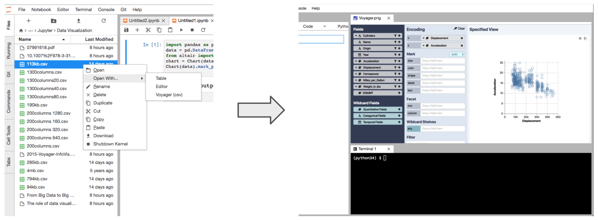
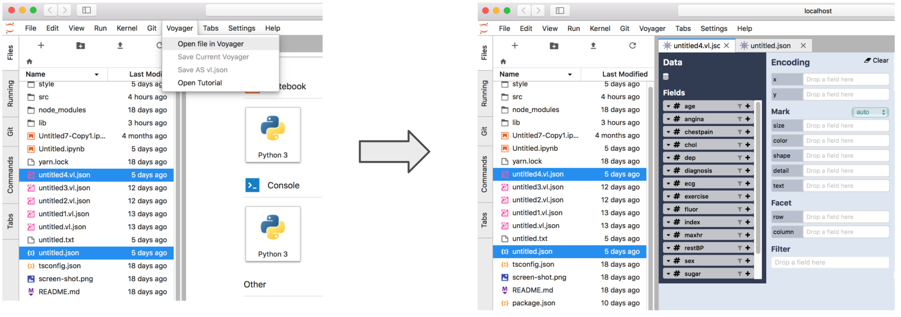
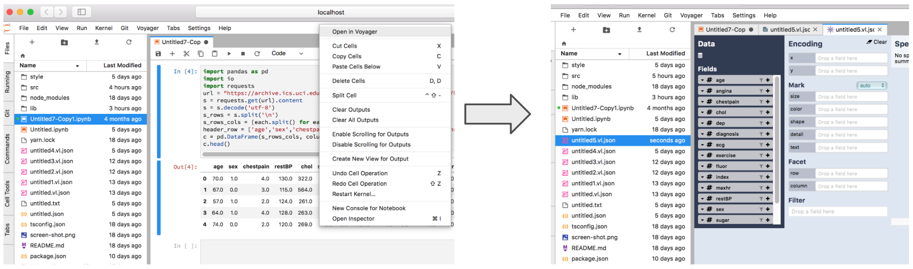

# JupyterLab_Voyager Tutorial

‘JupyterLab_ Voyager’ is a plugin extension for JupyterLab that provides a GUI for data visualization operations
and couples faceted browsing with visualization recommendation to support exploration of multivariate, tabular data. 
This extension can read data from  local file or graphs and tables in notebook cell, and pass it to Voyager interface 
to provide analytical reasoning through graphics.

Main functions of this extension are listed below:

## Open local files in Voyager

* Supported format: csv, tsv, json, vl.json
* Method 1: open through context menu
Right click on target file in Jupyterlab =>  select ‘open with’  => select ‘Voyager (filetype)’	

* Method 2: open through top menu bar
Select target files in JupyterLab => Click ‘Voyager’ in top menu =>  select ‘open file in Voyager’

## Open Notebook Table&Graph in Voyager
When using JupyterLab notebook cell graphs&tables as data source, a local ‘vl.json’ file containing data will be created before the voyager opens.
* Method: open through context menu
Right click on target graph or table  in Jupyterlab notebook cell =>  select ‘open with Voyager’
